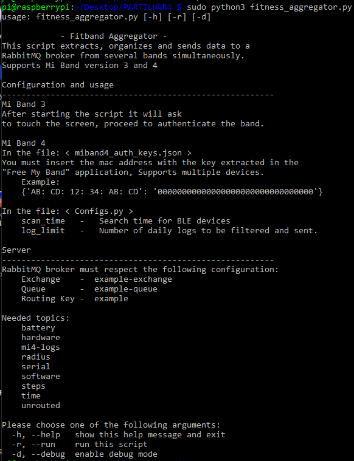

# Fitband Aggregator
--------------------------------------------------------

This script extracts, organizes and sends data to a
RabbitMQ broker from several bands simultaneously
\
Supports Mi Band version 3 and 4

# Configuration and usage
--------------------------------------------------------

## Mi Band 3       

After starting the script it will ask
to touch the screen, proceed to authenticate the band

## Mi Band 4      

In the file  < miband4_auth_keys.json >                                                       

You must insert the mac address with the key extracted in the "Free My Band" application  

Supports multiple devices              
\
\
In the file  < Configs.py >                                      
                        
scan_time   -   Search time for BLE devices                                                         
log_limit   -   Number of daily logs to be filtered and sent      

## Server
--------------------------------------------------------

RabbitMQ broker must respect the following configuration:           

Exchange    -  example-exchange                                 
Queue       -  example-queue                                    
Routing Key -  example                                          
                                                                    
## Needed Topics:                                                    
    battery                                                   
    hardware                                                        
    mi4-logs                                                        
    radius                                                          
    serial                                                          
    software                                                        
    steps                                                           
    time                                                            
    unrouted                                                        

##  Additional Functions

Changing the firmware           \
Sending personalized messages   \
Sending personalized calls      \
Sending missed calls            \
Modify time and date            \
Music controls                  

## Script

## Running the Script

## Published Message

## RabbitMQ Configuration - Exchange

## RabbitMQ Configuration - Queue

## RabbitMQ Configuration - Routing Key

## Multiple Devices

## Mi Band 3 - Pairing Confirmation

## Debug Mode

## Logs Usage

